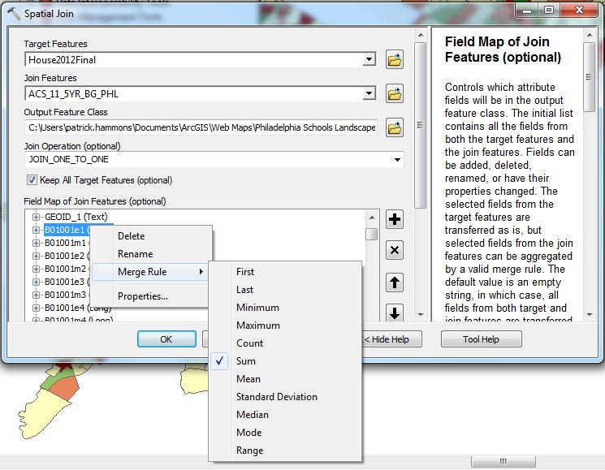
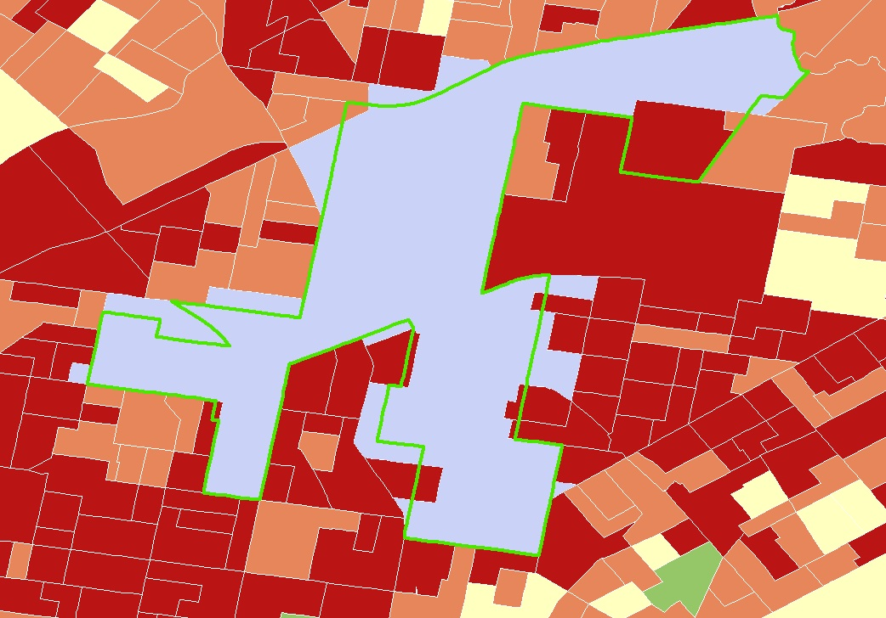

## The Problem of Boundary Mismatch

*The tutorial that follows is written for users of ESRI products, but may be adapted in the future to reference QGIS*
### Why Boundaries Matter
One of the biggest issues when it comes to mapping out data is how we define boundaries. [Geographers are always talking about this,](http://en.wikipedia.org/wiki/Modifiable_areal_unit_problem) but it's more than just a theoretical conundrum -- it's [an everyday GIS question ](http://giscollective.org/geographic-data-assumptions-maup-and-ecological-fallacies/)we have to grapple with

We can _lie_ about our data by drawing our boundaries in deceptive ways, spatially cherrypicking patterns to fit an argument we are trying to convey. Then all we have to do is plot it on a map and **VOILA** we can prove whatever we want! Obviously, this is a big problem -- particularly as most casual map readers see maps as objective representations of the real world -- but that doesn't mean that boundaries are entirely subjective. From an administrative standpoint, **boundaries have clear significance that can be felt**. From collecting taxes, to assigning policing responsibilities, to funding schools, boundaries DO matter because we as a society organize space accordingly.

### An Everyday Scenario
Let's say I work for a state representative who wants a more complete picture of her consituency. I took a couple of sociology classes in college, so I know that the main source for demographic data comes from the U.S. Census Bureau. After a little digging, I learn that the Census uses [certain boundaries](http://www.census.gov/geo/maps-data/data/tiger-cart-boundary.html) in carrying out their work. Unfortunately, none of these line up perfectly with the district we serve, so I have to figure out some way to merge the Census boundaries with state house districts. That's where the trusty spatial join comes in.

### Meet our Friend The Join
Joining data is your bread and butter when doing stuff in a GIS. Typically, there are two types of joins:
- **Tabular Join**: based on a shared field between two tables
- **Spatial Join**: based on some kind of spatial relatonship

In my example I want to take data that exists in one dataset and put it in another that physically overlaps it, so a spatial join is the way to go. [There are many things to consider when performing a spatial join,](http://help.arcgis.com/en/arcgisdesktop/10.0/help/index.html#/Spatial_Join/00080000000q000000/) but for our purposes we just need to pay attention to
- **Target Features**
- **Join Features**
- **Join Operation**
- **Field Map of Join Features**

That last parameter is very important and will take the most thought/time, depending on how many fields you want to aggregate.

_So many choices..._

**NOTE:** the default merge rule setting is _First_, which just takes the value of the first record in the join feature class. For quantitative data, there is little reason to choose this rule, so be careful.

### Setting Up The Join
This is where you need to determine what you're trying to get at with your data. Are you looking for raw counts? Then _Sum_ is for you. Averages between your records? Then you should aggregate by _Mean_. It's really easy to screw up if you don't know your data very well (e.g. adding up average ages won't tell you anything), so pore over your metadata if you need to.

Once you figure out what to do with your data, now you can go crazy with your merge rules. If you're working with census data, you might have a ridiculous amount of fields. Unfortunately there's not a way to select one rule for a lot of fields at once, so you may have to spend a bit of time monotonously right-clicking fields, but hey, you can always listen to an [interesting podcast](http://www.thisamericanlife.org/podcast) while you're at it, right?

Once you're done with all the right-clicking, you should have a bunch of polygons that look something like this:

_Boundary mismatch in action._

Your new feature class, should be populated with data from the join features according to the merge rule you selected. The example above was performed based on centroid, but you can choose other types of spatial relationships using the _Match Rule_ parameter. To minimize boundary mismatch or overhang, use the smallest (i.e. finest grain) join feature available. If you need your data to exactly match the larger polygons for symbolization purposes, you can join your new aggregate feature class to your target feature class, but this is entirely up to you. Otherwise, record some metadata and be on your merry aggregating way!

### Final Considerations

One take away from the image above is that it is very difficult to remove overlap entirely. There are other ways to estimate values to more neatly fit into a polygon (e.g. convert to a raster and use a polygon to essentially take an average of the original values), but these methods are still not completely precise. That said, it is possible to make reasonably good estimations following processes like the one here.

**Questions? Comments? Empty threats? Feel free to forward all to [Patrick.](mailto:patrick.t.hammons@gmail.com)**
